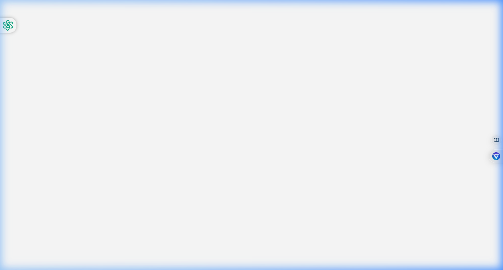
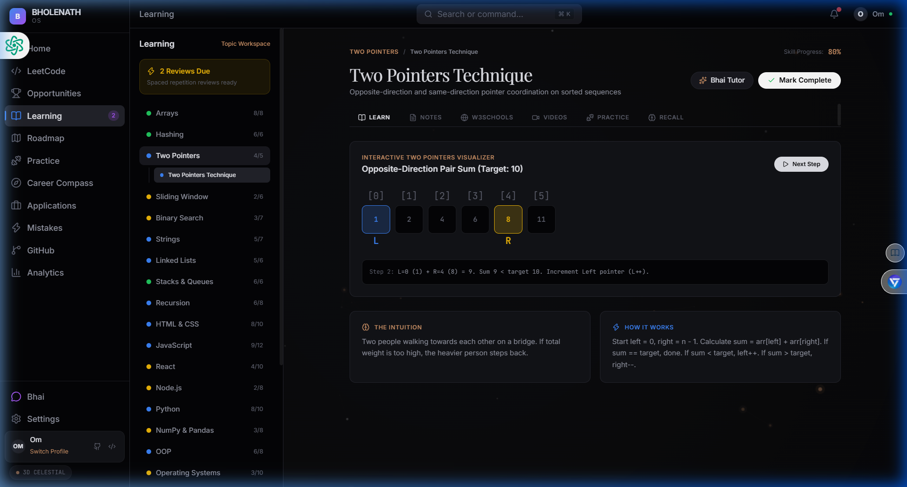
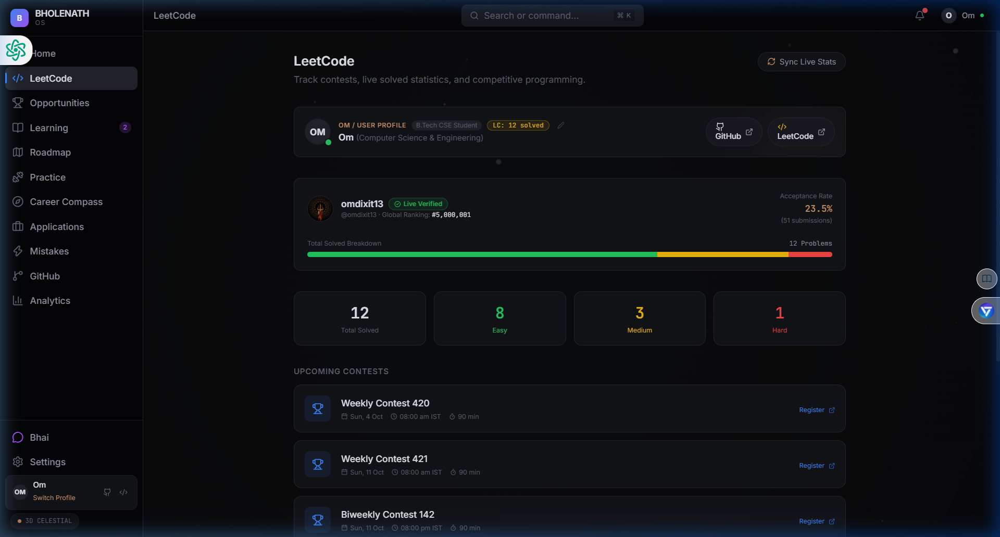

# 🌌 DevCoder OS (BHOLENATH OS)

<p align="center">
  <strong>Find it. Learn it. Build it. Get ready.</strong><br>
  <em>The Ultimate Personal Developer Career + Competitive Programming + Learning OS for Computer Science Engineers.</em>
</p>

<p align="center">
  
  
  
  
  
  
</p>

---

## 📸 Screenshots & Showcase

### 1. 🌌 Interactive Atmosphere & Career Dashboard
> Calm, editorial dark-mode interface featuring dynamic 3D celestial particle meshes with real-time mouse interaction and sound architecture.



---

### 2. 🧠 Active Learning Sandboxes & Topic Visualizers
> Interactive algorithm sandboxes for Two Pointers, Sliding Window, Binary Search, Stacks/Queues, and SQL Injection with active recall tests and curated video lectures.



---

### 3. 📊 Real-Time LeetCode Stats Sync
> Live GraphQL connection to LeetCode API displaying verified global rankings, total solved count (Easy, Medium, Hard breakdown), and acceptance rate.



---

## ✨ Core Pillars & Highlights

- **⚡ Multi-User Self-Service Profile:** Anyone can download the app, open the Profile Modal, and link their own LeetCode & GitHub handles to see their live stats instantly.
- **🌌 Dynamic 3D Celestial Mesh Canvas:** Customizable atmosphere (Celestial, Matrix, Grid, Minimal) that reacts organically to cursor movements.
- **🧭 Career Compass & Micro-Experiments:** 14-question personality assessment mapping you to 10 curated tech tracks (Backend, Systems, DevOps, AI/ML, Full-Stack, Security, etc.) with hands-on mini-experiments.
- **📚 30+ Deep Engineering Concept Workspaces:** From fundamental Data Structures (Arrays, Two Pointers, Trees, Graphs) to Full-Stack, OS internals, and Web Security.
- **🚀 GitHub Solution Sync:** Commit and push your solved competitive programming problems directly into your personal repository with timestamped problem logs.
- **🤖 "Bhai" AI Career Mentor:** Real-time engineering mentor chat ready to debug code, explain complex concepts simply, and keep your prep on track.
- **💼 Opportunities Radar:** Curated database of hackathons, open-source programs (GSOC, MLH), CTFs (PicoCTF), and internships with stage tracking.

---

## 📥 Download Windows Desktop App (`.exe`)

You can install DevCoder OS directly on Windows without installing Node.js or development dependencies:

1. Head over to the **[Releases](https://github.com/omdixit13/devcoder-os/releases)** tab.
2. Download the latest **`BHOLENATH OS Setup 1.0.0.exe`**.
3. Double-click to install and launch!

---

## 🛠️ Local Development & Running from Source

### Prerequisites
- Node.js (v18 or higher recommended)
- npm or pnpm

### 1. Clone the repository
```bash
git clone https://github.com/omdixit13/devcoder-os.git
cd devcoder-os
```

### 2. Install dependencies
```bash
npm install
```

### 3. Run Web Dev Server
```bash
npm run dev
```
Open [http://localhost:5173](http://localhost:5173) in your browser.

### 4. Run Desktop Electron App
```bash
npm run electron:dev
```

### 5. Build Desktop Installer (`.exe`)
```bash
npm run electron:build
```
The compiled installer will be saved in `dist/BHOLENATH OS Setup 1.0.0.exe`.

---

## 🏗️ Architecture & Technology Stack

| Layer | Technologies |
|---|---|
| **Desktop Shell** | Electron 44, IPC Handlers (CORS-free GraphQL queries, External Browser Shell) |
| **Frontend Framework** | React 19, TypeScript, Vite |
| **Styling & Motion** | TailwindCSS, Framer Motion, HTML5 3D Canvas Mesh |
| **State Management** | Zustand (Persistent Local Storage Migration v3) |
| **Icons & Audio** | Lucide React, Web Audio API Sound Synthesizer |
| **Packaging** | Electron Builder (NSIS Windows Installer) |

---

## 👤 Author

**Om Dixit**
- 🌐 GitHub: [@omdixit13](https://github.com/omdixit13)
- 💻 LeetCode: [omdixit13](https://leetcode.com/u/omdixit13)

---

## 📄 License

This project is licensed under the MIT License — see the [LICENSE](LICENSE) file for details.
